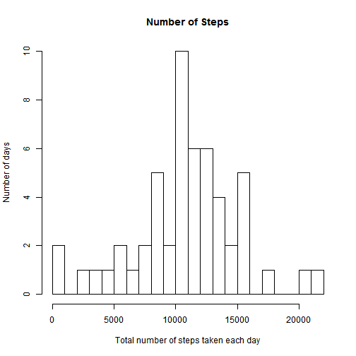
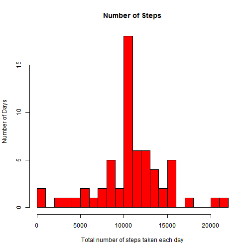

## Loading and preprocessing the data

```r
unzip("activity.zip")
dt <- read.csv("activity.csv",header = T)
data <- subset(dt,is.na(dt$steps)==F)
data$int <- sprintf("%04d",data$interval)
data$time <-paste(data$date,data$int,sep=" ")
data$da <- strptime(x = data$time,format = "%Y-%m-%d %H%M")
data$date <- as.Date(data$date, "%Y-%m-%d")
```

## What is mean total number of steps taken per day?

1.Calculate the total number of steps taken per day

```r
data_df <- factor(data$date)
dailysteps <- tapply(data$steps, data_df,FUN = sum)
```
2. Make a histogram of the total number of steps taken each day

```r
hist(dailysteps,breaks = 20, main = "Number of Steps",xlab="Total number of steps taken each day",ylab="Number of days")
```

 
3.Calculate and report the mean and median of the total number of steps taken per day
mean

```r
mean(dailysteps)
```

```
## [1] 10766.19
```
median

```r
median(dailysteps)
```

```
## [1] 10765
```

## What is the average daily activity pattern?
1.Make a time series plot (i.e. type = "l") of the 5-minute interval (x-axis) and the average number of steps taken, averaged across all days (y-axis)

```r
library(ggplot2)
stepsn <- aggregate(x = list(data$steps),by = list(data$interval),FUN = "mean")
names(stepsn)<-c("interval","stepsMean")
ggplot(data = stepsn, aes(x = interval, y = stepsMean)) + geom_line() + xlab("5-minute interval") +  ylab("average number of steps taken")
```

 


2.Which 5-minute interval, on average across all the days in the dataset, contains the maximum number of steps?

```r
stepsn[stepsn$stepsMean == max(stepsn$stepsMean),]
```

```
##     interval stepsMean
## 104      835  206.1698
```

## Imputing missing values
1. total number of missing values in the dataset 

```r
sum(is.na(dt))
```

```
## [1] 2304
```
2.Devise a strategy for filling in all of the missing values in the dataset. 
fill the NA with average value for that 5-min interval

3.Create a new dataset that is equal to the original dataset but with the missing data filled in.

```r
datanew <- dt
for(i in 1:nrow(datanew)){
  if(is.na(datanew$steps[i])){
    datanew$steps[i] <- stepsn$steps[which(datanew$interval[i]==stepsn$interval)]
  }
}
datanew <- arrange(datanew,interval)
```
4.Make a histogram of the total number of steps taken each day and Calculate and report the mean and median total number of steps taken per day.

```r
totalnew <- ddply(datanew, .(date), summarise, steps=sum(steps))
hist(totalnew$steps, breaks = 20, main="Number of Steps", xlab="Total number of steps taken each day", ylab = "Number of Days", col="red")
```

 

```r
mean(totalnew$steps)
```

```
## [1] 10766.19
```

```r
median(totalnew$steps)
```

```
## [1] 10766.19
```
So, after imputing the missing data, the new mean of total steps taken per day is equal to the old mean; the new median of total steps taken per day is greater than that of the old median.

## Are there differences in activity patterns between weekdays and weekends?
1.Create a new factor variable in the dataset with two levels -- "weekday" and "weekend" indicating whether a given date is a weekday or weekend day.

```r
datanew$weekdays <- weekdays(as.Date(datanew$date))
datanew$weekdays <- ifelse(datanew$weekdays %in% c("Saturday", "Sunday"),"weekend", "weekday")
```
2.Make a panel plot containing a time series plot (i.e. type = "l") of the 5-minute interval (x-axis) and the average number of steps taken, averaged across all weekday days or weekend days (y-axis).

```r
library(lattice)

stepsM <- aggregate(datanew$steps, list(interval = as.numeric(as.character(datanew$interval)),FUN = "mean", weekdays = datanew$weekdays))
```

```
## Error in match.fun(FUN): argument "FUN" is missing, with no default
```

```r
names(stepsM)[3] <- "StepsMean"

xyplot(stepsM$StepsMean ~ stepsM$interval | stepsM$weekdays,layout = c(1, 2), type = "l",xlab = "Interval", ylab = "Number of steps")
```

 

